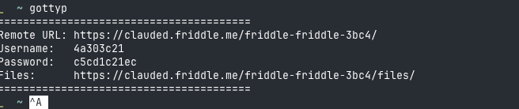
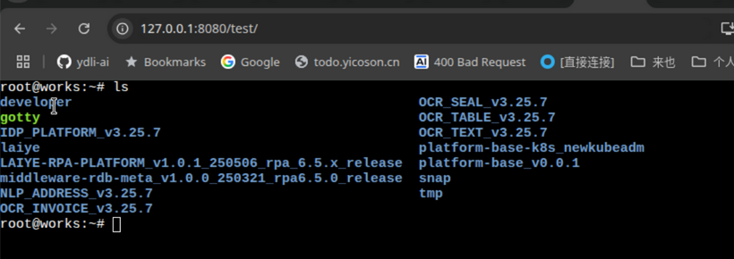

# gotty-piko

[中文文档](README_CN.md) | English

An efficient terminal-based remote assistance tool that integrates gotty and piko services. Designed for remote assistance in complex network environments, avoiding the high bandwidth dependency of traditional remote desktop solutions while eliminating the need for complex network configurations and public IP addresses.

**Note:**
1. Windows solution is still under research. Cannot use gotty
2. Currently no security verification implemented. Token authorization will be implemented next

## Features

- 🚀 **Lightweight**: Terminal-based remote assistance with low resource usage
- 🌐 **Network-friendly**: Supports intranet penetration, no public IP required
- 🔧 **Easy Deployment**: One-click Docker deployment with simple configuration
- 🔒 **Secure & Reliable**: Based on SSH protocol with user authentication support
- 📱 **Cross-platform**: Supports Linux, macOS
- 💻 **Smart Shell**: Automatically selects appropriate shell based on operating system (PowerShell for Windows, Bash for Linux)

## Architecture

```
Client (gotty-piko client)
    ↓ Local Shell
gotty service
    ↓ HTTP access
Browser terminal
```

## Quick Start

### Server Deployment

1. **Deploy using Docker Compose**

```yaml
# docker-compose.yaml
version: "3.8"
services:
  piko:
    image: ghcr.io/friddle/gotty-piko-server:latest
    container_name: gotty-piko-server
    environment:
      - PIKO_UPSTREAM_PORT=8022
      - LISTEN_PORT=8088
    ports:
      - "8022:8022"
      - "8088:8088"
    restart: unless-stopped
```

Or using Docker directly:

```bash
docker run -ti --network=host --rm --name=piko-server ghcr.io/friddle/gotty-piko-server
```


2. **Start the service**

```bash
docker-compose up -d
```

### Client Usage

#### Linux Client

```bash
# Download client
wget https://github.com/friddle/gotty-piko/releases/download/v1.0.0/gottyp-linux-amd64 -O ./gottyp
chmod +x ./gottyp

./gottyp --name=local --remote=192.168.1.100:8088(ServerIP:PORT)
```

#### macOS Client

```bash
# Download client
curl -L -o gottyp https://github.com/friddle/gotty-piko/releases/download/v1.0.0/gottyp-darwin-amd64
chmod +x ./gottyp

./gottyp --name=local --remote=192.168.1.100:8088(ServerIP:PORT)
```




## Access Methods

After starting the client, access the corresponding terminal via:
```
http://host-server-ip:port/client-name
```

Example:
- Server listening address: `192.168.1.100:8088` (server IP and NGINX)
- Client name: `local`
- Access URL: `http://192.168.1.100:8088/local`

## Configuration

### Client Parameters

| Parameter | Description | Default | Required |
|-----------|-------------|---------|----------|
| `--name` | piko client identifier name | - | ✅ |
| `--remote` | Remote piko server address (format: host:port) | - | ✅ |
| `--terminal` | Specify terminal type to use (zsh, bash, sh, powershell, etc.) | Auto-select | ❌ |

### Server Environment Variables

| Variable | Description | Default |
|----------|-------------|---------|
| `PIKO_UPSTREAM_PORT` | Piko upstream port | 8022 |
| `LISTEN_PORT` | HTTP listen port | 8088 |

### Shell Selection

The client automatically selects the appropriate shell based on the operating system:
- **Linux/macOS**: Bash
- **Others**: sh

You can also manually specify the terminal type using the `--terminal` parameter or `TERMINAL` environment variable.
