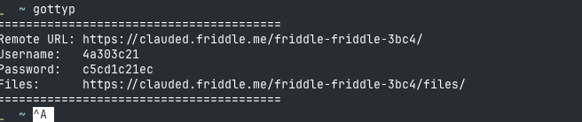
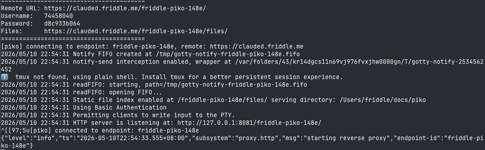
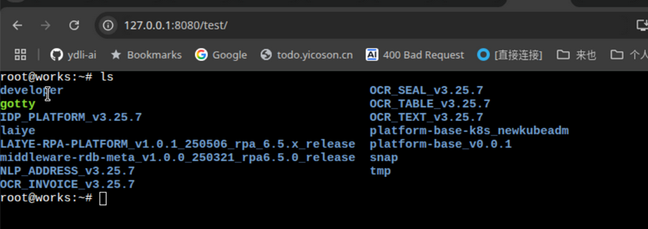

# gotty-piko

English | [中文文档](README_CN.md)

一个基于终端的高效远程协助工具，集成了 gotty 和 piko 服务。专为复杂网络环境下的远程协助而设计，避免传统远程桌面对高带宽的依赖，也无需复杂的网络配置和外网地址。

[gotty](https://github.com/friddle/gotty) (fork 定制版)
[piko](https://github.com/andydunstall/piko)

> **强烈建议自己部署（self-host）！** 公共服务器仅供体验，生产环境请自行部署 piko + gottyp，避免安全隐患、性能瓶颈和会话命名冲突。
> 
> **自托管源码：** https://github.com/friddle/claude-web-remote/tree/main/cmd/server  
> **Docker 镜像：** `ghcr.io/friddle/gottyp-piko-server:latest`

**注意：**
1. Windows 方案使用 [goxrdp-piko](https://github.com/friddle/goxrdp-piko)

## 项目特点

- 一体化二进制：gotty + piko 一条命令启动
- 守护进程模式（默认开启）：后台运行
- 自动生成会话ID：`{用户}_{目录}_{随机数}`
- 默认开启 Basic Auth，自动生成账号密码
- notify-send 拦截：桌面通知推送到浏览器右下角
- Webhook 转发：支持飞书兼容的通知推送
- 静态文件浏览：通过 `/files/` 路径访问
- 端口代理：通过 `/port/{port}` 路径转发
- tmux 集成：持久化会话
- 跨平台：Linux、macOS、Android

## 截图

### CLI 启动（守护进程模式）



### CLI 启动（前台模式 `--daemon=false`）



### Web 界面



## 架构说明

```
gottyp (客户端)
  ├── gotty (本地 Web 终端)
  │     ├── /{session}/          → 终端 Web UI
  │     ├── /{session}/files/    → 静态文件浏览器
  │     └── /{session}/port/{p}  → 端口代理
  └── piko client → piko server → 浏览器 (通过 CDN)
```

## 快速开始

### 服务端部署

```yaml
# docker-compose.yaml
version: "3.8"
services:
  clauded:
    image: ghcr.io/friddle/gottyp-piko-server:latest
    container_name: clauded
    environment:
      - PIKO_UPSTREAM_PORT=8022
    ports:
      - "80:80"
    restart: unless-stopped
```

```bash
docker-compose up -d
```

### 服务端环境变量

| 变量名 | 默认值 | 说明 |
|--------|--------|------|
| `LISTEN_PORT` | `80` | HTTP 服务端口 |
| `PIKO_UPSTREAM_PORT` | `8022` | Piko 上游端口（内部使用） |
| `ENABLE_TLS` | `false` | 是否启用 HTTPS |
| `TLS_CERT_FILE` | - | TLS 证书路径 |
| `TLS_KEY_FILE` | - | TLS 私钥路径 |
| `UPSTREAM_KEY` | - | 上游连接认证的 HMAC 密钥 |

### 客户端使用

```bash
# 下载
wget https://github.com/friddle/gotty-piko/releases/latest/download/gottyp-linux-amd64 -O ./gottyp
chmod +x ./gottyp

# 启动（守护进程模式，默认远程: https://clauded.friddle.me）
./gottyp

# 指定会话名
./gottyp --session myserver

# 关闭认证
./gottyp --auth=false

# 启用静态文件浏览和端口代理
./gottyp --static-index=/home/user --attach-port=3000

# 前台模式
./gottyp --daemon=false
```

输出示例：
```
========================================
Remote URL: https://clauded.friddle.me/user_project_a1b2/
Username:   x7kq3m
Password:   p9w2nfc8h4
Port Proxy: https://clauded.friddle.me/user_project_a1b2/port/3000
Files:      https://clauded.friddle.me/user_project_a1b2/files/
========================================
```

## 访问方式

| URL | 说明 |
|-----|------|
| `https://clauded.friddle.me/{session}/` | 终端 Web UI |
| `https://clauded.friddle.me/{session}/files/` | 静态文件浏览器 |
| `https://clauded.friddle.me/{session}/port/{port}` | 端口代理 |

## 上游认证

为了保护客户端和服务端之间的连接，可以使用 `--upstream-key` 参数（或 `UPSTREAM_KEY` 环境变量）进行认证。

**服务端：**
```bash
# 命令行
./server --upstream-key=my-secret

# Docker Compose
environment:
  - UPSTREAM_KEY=my-secret
```

**客户端：**
```bash
./gottyp --remote=your-server.com --upstream-key=my-secret
```

两边必须使用**相同的密钥**。客户端会自动用该密钥生成 JWT token 进行认证。

## 配置说明

### 客户端参数

| 参数 | 说明 | 默认值 |
|------|------|--------|
| `--session` | 会话ID（piko endpoint + gotty 路径） | `{用户}_{目录}_{随机数}` |
| `--remote` | Piko 服务器 URL | `https://clauded.friddle.me` |
| `--auth` | 启用 Basic Auth | `true` |
| `--auth-name` | 认证用户名 | 自动生成 |
| `--pass` | 认证密码 | 自动生成 |
| `--terminal` | 终端类型 (zsh, bash, sh 等) | 自动选择 |
| `--tmux` | 使用 tmux 保持会话 | `true` |
| `--daemon` | 守护进程模式（后台运行） | `true` |
| `--pid-file` | PID 文件路径 | `/tmp/gottyp.pid` |
| `--enable-notify` | 拦截 notify-send | `true` |
| `--notify-webhook` | Webhook URL（飞书兼容） | 禁用 |
| `--static-index` | /files/ 对应的目录 | 当前目录 |
| `--attach-port` | /port/ 代理的目标端口 | 禁用 |
| `--auto-exit` | 24小时后自动退出 | `true` |
| `--upstream-key` | 上游连接认证的 HMAC 密钥 | 禁用 |

### 子命令

```bash
gottyp tmux list        # 列出 tmux 会话
gottyp tmux kill-all    # 终止所有 tmux 会话和 gottyp 守护进程
```

### 环境变量

| 变量 | 说明 |
|------|------|
| `SESSION` | 会话ID |
| `AUTH_NAME` | 认证用户名 |
| `PASS` | 认证密码 |
| `REMOTE` | Piko 服务器 URL |
| `TERMINAL` | 终端类型 |
| `DAEMON` | 守护进程模式 |
| `ENABLE_NOTIFY` | 通知拦截 |
| `NOTIFY_WEBHOOK` | Webhook URL |
| `STATIC_INDEX` | 静态文件目录 |
| `ATTACH_PORT` | 端口代理目标 |
| `UPSTREAM_KEY` | 上游连接认证密钥 |
