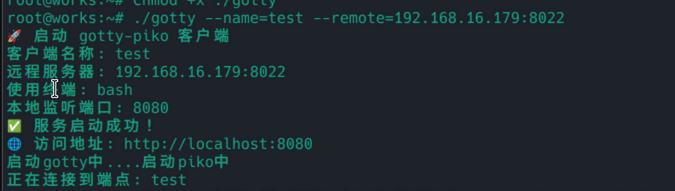

# gotty-piko

一个基于终端的高效远程协助工具，集成了 gotty 和 piko 服务。专为复杂网络环境下的远程协助而设计，避免传统远程桌面对高带宽的依赖，也无需复杂的网络配置和外网地址。

**注意：**
1. Windows方案还在研究。不能使用gotty
2. 暂时没有任何安全验证。token授权会在接下来实现

## 项目特点

- 🚀 **轻量级**: 基于终端的远程协助，资源占用低
- 🌐 **网络友好**: 支持内网穿透，无需公网IP
- 🔧 **简单部署**: Docker 一键部署，配置简单
- 🔒 **安全可靠**: 基于 SSH 协议，支持用户认证
- 📱 **跨平台**: 支持 Linux、macOS
- 💻 **智能Shell**: 自动根据操作系统选择合适shell（Windows用PowerShell，Linux用Bash）

## 架构说明

```
客户端 (gotty-piko client) 
    ↓ 本地Shell
gotty服务
    ↓ HTTP访问
浏览器终端
```

## 快速开始

### 服务端部署

1. **使用 Docker Compose 部署**

```yaml
# docker-compose.yaml
version: "3.8"
services:
  piko:
    image: ghcr.io/friddle/gotty-piko-server:latest
    container_name: gotty-piko-server
    environment:
      - PIKO_UPSTREAM_PORT=8022
      - LISTEN_PORT=8088
    ports:
      - "8022:8022"
      - "8088:8088"
    restart: unless-stopped
```

或直接使用 Docker：

```bash
docker run -ti --network=host --rm --name=piko-server ghcr.io/friddle/gotty-piko-server
```

2. **启动服务**

```bash
docker-compose up -d
```

### 客户端使用

#### Linux 客户端

```bash
# 下载客户端
wget https://github.com/friddle/gotty-piko/releases/download/v1.0.0/gottyp-linux-amd64 -O ./gottyp
chmod +x ./gottyp

./gottyp --name=local --remote=192.168.1.100:8088
```

#### macOS 客户端

```bash
# 下载客户端
curl -L -o gottyp https://github.com/friddle/gotty-piko/releases/download/v1.0.0/gottyp-darwin-amd64
chmod +x ./gottyp

./gottyp --name=local --remote=192.168.1.100:8088
```




## 访问方式

当客户端启动后，通过以下地址访问对应的终端：
```
http://主机服务器IP:端口/客户端名称
```

例如：
- 服务端监听的地址: `192.168.1.100:8088` (服务端IP和NGINX)
- 客户端名称: `local`
- 访问地址: `http://192.168.1.100:8088/local`

## 配置说明

### 客户端参数

| 参数 | 说明 | 默认值 | 必填 |
|------|------|--------|------|
| `--name` | piko 客户端标识名称 | - | ✅ |
| `--remote` | 远程 piko 服务器地址 (格式: host:port) | - | ✅ |
| `--terminal` | 指定要使用的终端类型 (zsh, bash, sh, powershell 等) | 自动选择 | ❌ |

### 服务端环境变量

| 变量 | 说明 | 默认值 |
|------|------|--------|
| `PIKO_UPSTREAM_PORT` | Piko 上游端口 | 8022 |
| `LISTEN_PORT` | HTTP 监听端口 | 8088 |

### Shell 选择

客户端会根据操作系统自动选择合适的shell：
- **Linux/macOS**: Bash
- **其他**: sh

也可以通过 `--terminal` 参数或 `TERMINAL` 环境变量手动指定终端类型。

